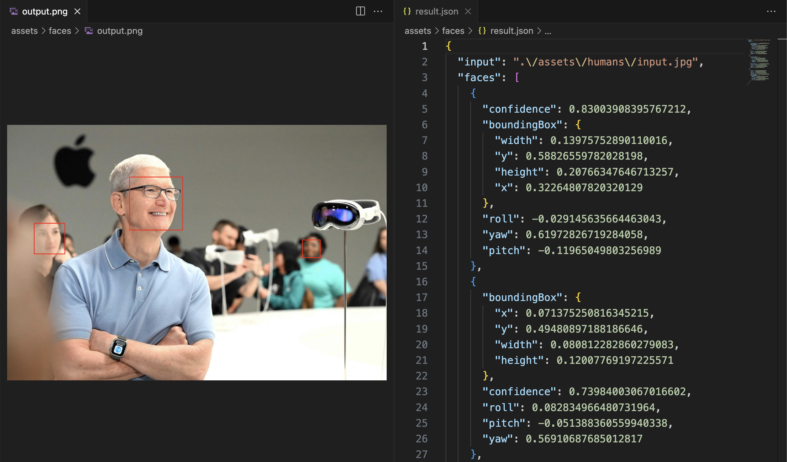
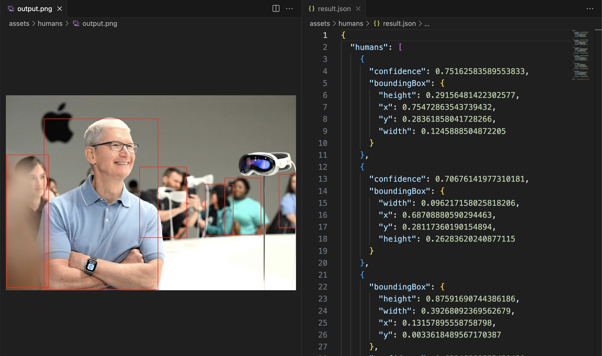
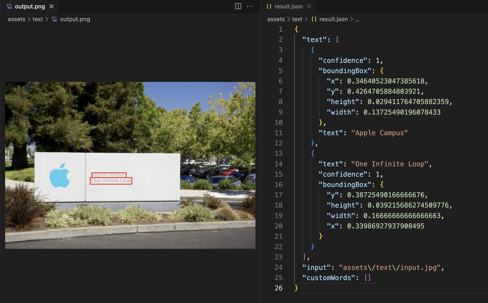
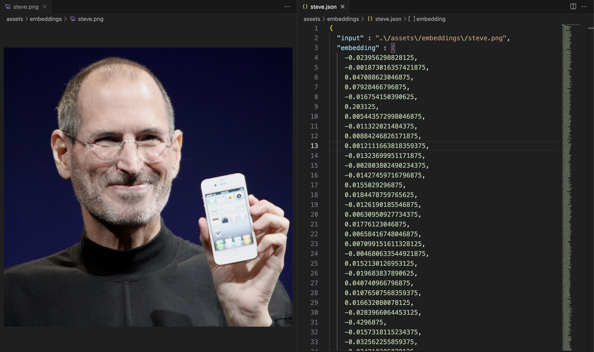

# seeV

seeV is a macOS command line wrapper around the [Apple Vision framework](https://developer.apple.com/documentation/vision). Its goal is to unlock the functionality of the framework for use in shell scripts and other command line tools. seeV is written in Swift and works on macOS 10.14 and later.

Because Vision.framework ships on macOS, seeV does not require any additional dependencies or network access. It is a single executable that can be copied to any location on your system.

## Supported Operations

### Subject Extraction


```sh
seev input.jpg -o output.png
```

* On a 2020 M1 MacBook Air subject extraction completes in under one second
* Image can be output to a specified file or stdout

### Face Detection



```sh
seev faces input.jpg -o output.png
```

* Results are output in JSON and include the bounding box of each detected face
* Red bounding boxes can be drawn around each face
* Output can be cropped to just the face

### Human Detection



```sh
seev humans input.jpg -o output.png
```

* Results are output in JSON and include the bounding box of each detected human
* Only the upper body needs to be visible for detection (does not require full body)
* Red bounding boxes can be drawn around each human

### Text Detection (OCR)



```sh
seev text input.jpg -o output.png
```

* Results are output in JSON and include the bounding box of each detected phrase
* Red bounding boxes can be drawn around each phrase
* Custom words to identify can be provided as a command line argument

### Embeddings



```sh
seev embeddings input.jpg
```


```sh
seev distance input.jpg -o comparison.png
```

* Embeddings are provided as a JSON object and include an array of floating point numbers
  * See [example](assets/embeddings/steve.json)
* Embeddings can be used to quantitatively assess image similarity

### Image Distance


```sh
seev distance input.jpg -o comparison.png
```

* Calculates distance between images e.g. how similar are two images
* Automatically generates embeddings and compares using cosine similarity
* Distance is a floating point number between 0 and 1
* Lower distance means images are more similar

## Installation

### Release

You can download the latest M1 build from the [Releases]( https://github.com/Nexuist/seeV/releases) page.

### Build from Source

```bash
swift build --configuration release
cp -f .build/release/seev /usr/local/bin/seev
```

## Development

```sh
swift run seev <arguments>
```

* Don't forget to increment the version number in `seev.swift`

## Next Steps

* Determine which Vision.framework features to support next (pose detection, animals, etc)
* Provide feedback and development direction in [this issue](https://github.com/Nexuist/seeV/issues/7)

## License

```text
MIT License

Copyright (c) 2023 Andi Andreas

Permission is hereby granted, free of charge, to any person obtaining a copy
of this software and associated documentation files (the "Software"), to deal
in the Software without restriction, including without limitation the rights
to use, copy, modify, merge, publish, distribute, sublicense, and/or sell
copies of the Software, and to permit persons to whom the Software is
furnished to do so, subject to the following conditions:

The above copyright notice and this permission notice shall be included in all
copies or substantial portions of the Software.

THE SOFTWARE IS PROVIDED "AS IS", WITHOUT WARRANTY OF ANY KIND, EXPRESS OR
IMPLIED, INCLUDING BUT NOT LIMITED TO THE WARRANTIES OF MERCHANTABILITY,
FITNESS FOR A PARTICULAR PURPOSE AND NONINFRINGEMENT. IN NO EVENT SHALL THE
AUTHORS OR COPYRIGHT HOLDERS BE LIABLE FOR ANY CLAIM, DAMAGES OR OTHER
LIABILITY, WHETHER IN AN ACTION OF CONTRACT, TORT OR OTHERWISE, ARISING FROM,
OUT OF OR IN CONNECTION WITH THE SOFTWARE OR THE USE OR OTHER DEALINGS IN THE
SOFTWARE.
```
