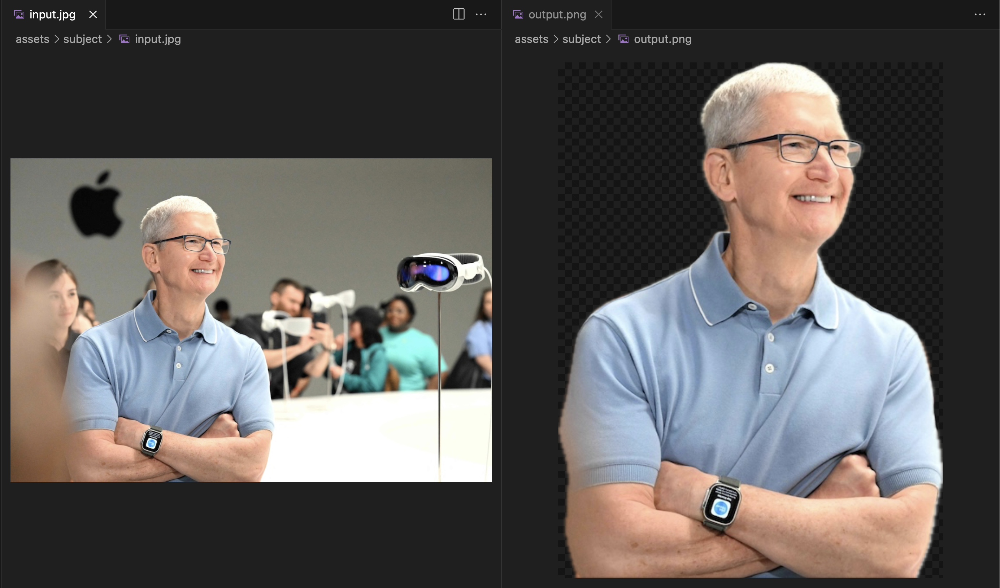
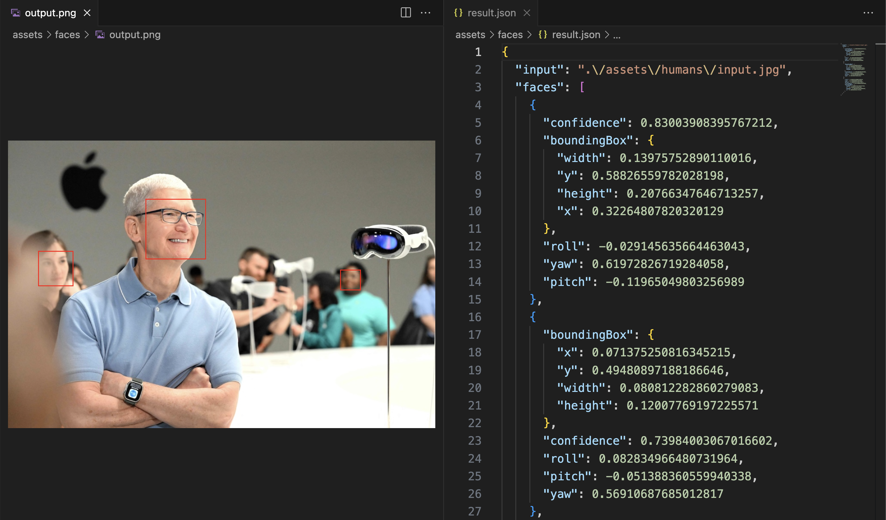
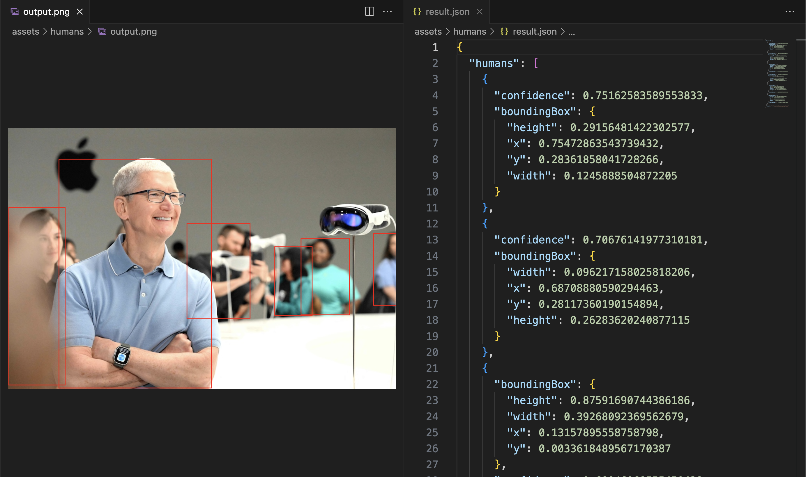
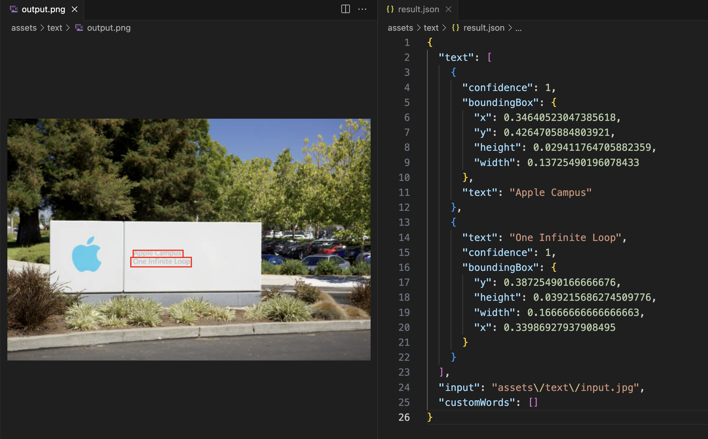
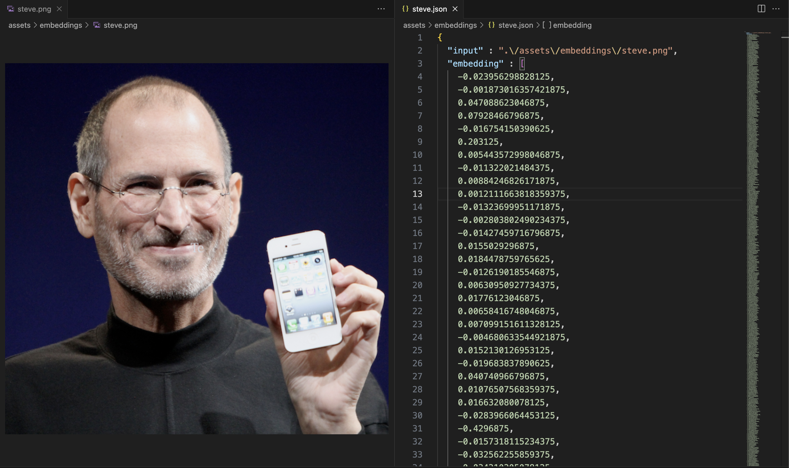
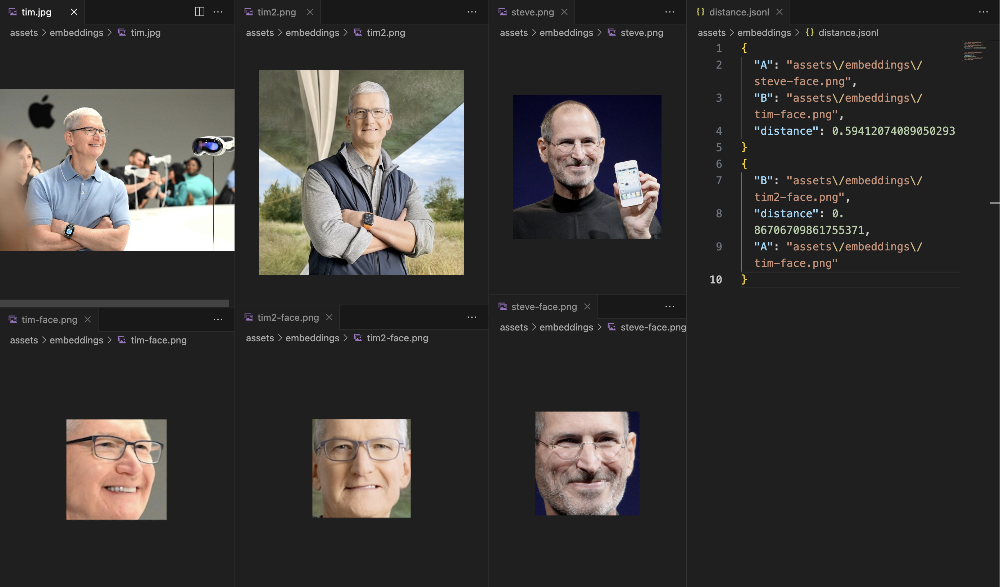

# seeV

seeV is a macOS command line wrapper around the [Apple Vision framework](https://developer.apple.com/documentation/vision). Its goal is to unlock the functionality of the framework for use in shell scripts and other command line tools. seeV is written in Swift and requires macOS 15 or later.

Most seeV operations have no runtime dependencies or network requirements because Vision.framework ships with macOS. The `nsfw` command and the NSFW phase of `all` additionally require [Ollama](https://ollama.com/) and an installed image-capable [ShieldGemma 2](https://huggingface.co/google/shieldgemma-2-4b-it) model. The `most` command never uses Ollama.

## Supported Operations

### Subject Extraction



```sh
seev input.jpg -o output.png
```

* On a 2020 M1 MacBook Air subject extraction completes in under one second
* Image can be output to a specified file or stdout

### Face Detection



```sh
seev faces input.jpg -o output.png
```

* Results are output in JSON and include the bounding box of each detected face
* Red bounding boxes can be drawn around each face
* Output can be cropped to just the face

### Human Detection



```sh
seev humans input.jpg -o output.png
```

* Results are output in JSON and include the bounding box of each detected human
* Only the upper body needs to be visible for detection (does not require full body)
* Red bounding boxes can be drawn around each human

### Pose Detection


```sh
seev poses input.jpg -o output.png
```

* Results are output in JSON and include the joints with x/y coordinates and confidence
* Joint locations and limb connections are drawn to the output image when `-o` is provided

### Text Detection (OCR)



```sh
seev text input.jpg -o output.png
```

* Results are output in JSON and include the bounding box of each detected phrase
* Red bounding boxes can be drawn around each phrase
* Custom words to identify can be provided as a command line argument

### Image Classification

```sh
seev classify input.jpg --minimum-confidence 0.4
```

* Returns identifiers from Apple's image classifier with their confidence levels
* Specific identifiers can be included with `--include-identifiers`, even below the confidence threshold

### Embeddings



```sh
seev embeddings input.jpg
```

* Embeddings are provided as a JSON object and include an array of floating point numbers
  * See [example](assets/embeddings/steve.json)
* Embeddings can be used to quantitatively assess image similarity

### Image Distance



```sh
seev distance input.jpg comparison.png
```

* Calculates distance between images e.g. how similar are two images
* Automatically generates embeddings and compares using cosine similarity
* Distance is a floating point number between 0 and 1
* Lower distance means images are more similar

### Image Quality

```sh
seev quality input.jpg
```

The `quality` command uses Apple Vision to score the aesthetic quality of an image:

```json
{
  "input": "input.jpg",
  "overallScore": 0.72,
  "isUtility": false
}
```

* `overallScore` ranges from `-1` (least desirable) to `1` (most desirable).
* `isUtility` identifies useful images that may not have memorable or exciting content.
* Scores are most useful for ranking images or video frames rather than as a universal pass/fail threshold.

### SHA-1 Hashing

```sh
seev sha1 input.jpg
```

* Returns a SHA-1 hash of the input file as JSON
* The hash can be used to identify exact duplicate files; it does not measure visual similarity

### Image Moderation

`seev nsfw` classifies images as NSFW using ShieldGemma 2 through Ollama. Its policy covers nudity, visible intimate body parts, and erotic presentation. It does not perform text moderation. Images remain on the local machine when using the default local Ollama endpoint.

```sh
seev nsfw input.jpg
```

The result is a boolean policy decision:

```json
{
  "input": "input.jpg",
  "model": "hf.co/infil00p/shieldgemma-2-4b-it-GGUF:Q4_K_M",
  "policy": "nsfw",
  "violation": false
}
```

ShieldGemma is a policy classifier: for each image and policy it answers `Yes` or `No`. It does not return bounding boxes or identify individual body parts. Applications should treat the result as one moderation signal, use a review path for uncertain or high-impact decisions, and evaluate the model against examples that match their own policy.

#### Ollama setup

Install Ollama:

```sh
brew install ollama
```

Start Ollama in one terminal:

```sh
ollama serve
```

Then download the image-capable ShieldGemma 2 model from another terminal:

```sh
ollama pull hf.co/infil00p/shieldgemma-2-4b-it-GGUF:Q4_K_M
```

The `ollama serve` process must be running when `seev nsfw` is invoked. If Ollama is already running as an app or background service, do not start a second instance.

The command always uses the ShieldGemma model above. The Ollama endpoint defaults to `http://127.0.0.1:11434` and can be overridden:

```sh
seev nsfw input.jpg --ollama-host http://127.0.0.1:11434
```

When a non-local Ollama endpoint is configured, the image is sent to that endpoint. On failure, `seev nsfw` writes a human-readable error to stderr, produces no JSON, and exits with a nonzero status. Errors are grouped into three categories: the fixed model is not installed, Ollama is unavailable, or an unknown classification error occurred.

The GGUF package above is a [third-party Ollama-compatible conversion](https://huggingface.co/infil00p/shieldgemma-2-4b-it-GGUF) of Google's [ShieldGemma 2](https://huggingface.co/google/shieldgemma-2-4b-it), not an Ollama model published by Google.

### Combined Analysis

```sh
seev all input.jpg
```

The `all` command runs faces, humans, text, poses, classification, embeddings, SHA-1, and NSFW classification independently. It accepts the same `--ollama-host` option as `nsfw`. A failed operation does not discard successful results; failures are returned in an `errors` object keyed by operation. For example, an unavailable Ollama service produces an `errors.nsfw` message while the Vision results are still returned. The command exits with a failure status only when every operation fails.

Use `most` for combined analysis without full-image embeddings, per-face embeddings, or NSFW classification. This keeps the JSON output substantially smaller and does not require Ollama:

```sh
seev most input.jpg
```

## Installation

### Release

You can download the latest M1 build from the [Releases](https://github.com/Nexuist/seeV/releases) page.

### Build from Source

```bash
swift build --configuration release
cp -f .build/release/seev /usr/local/bin/seev
```

## Development

```sh
swift run seev <arguments>
```

* Don't forget to increment the version number in `seev.swift`

## Next Steps

* Determine which Vision.framework features to support next (pose detection, animals, etc)
* Provide feedback and development direction in [this issue](https://github.com/Nexuist/seeV/issues/7)

## License

```text
MIT License

Copyright (c) 2024 Andi Andreas

Permission is hereby granted, free of charge, to any person obtaining a copy
of this software and associated documentation files (the "Software"), to deal
in the Software without restriction, including without limitation the rights
to use, copy, modify, merge, publish, distribute, sublicense, and/or sell
copies of the Software, and to permit persons to whom the Software is
furnished to do so, subject to the following conditions:

The above copyright notice and this permission notice shall be included in all
copies or substantial portions of the Software.

THE SOFTWARE IS PROVIDED "AS IS", WITHOUT WARRANTY OF ANY KIND, EXPRESS OR
IMPLIED, INCLUDING BUT NOT LIMITED TO THE WARRANTIES OF MERCHANTABILITY,
FITNESS FOR A PARTICULAR PURPOSE AND NONINFRINGEMENT. IN NO EVENT SHALL THE
AUTHORS OR COPYRIGHT HOLDERS BE LIABLE FOR ANY CLAIM, DAMAGES OR OTHER
LIABILITY, WHETHER IN AN ACTION OF CONTRACT, TORT OR OTHERWISE, ARISING FROM,
OUT OF OR IN CONNECTION WITH THE SOFTWARE OR THE USE OR OTHER DEALINGS IN THE
SOFTWARE.
```
